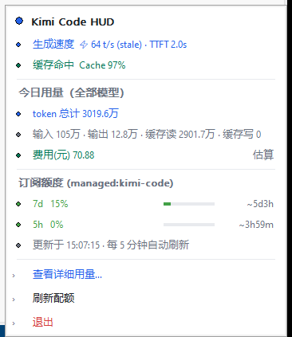
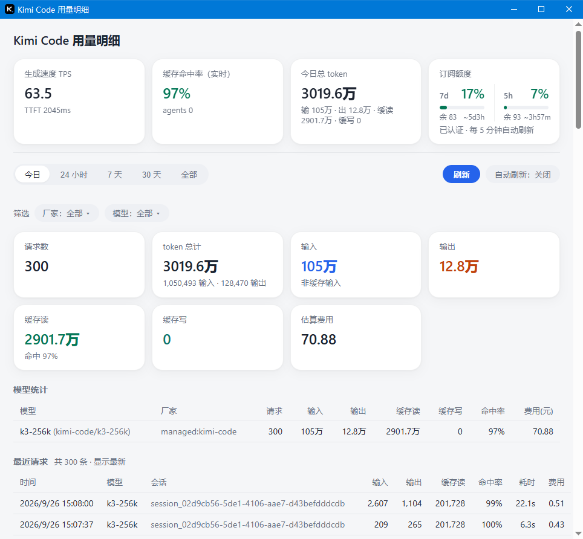

# kimi-hud

[English](README.md) | **简体中文**

kimi-hud 是一个用 Go 编写的 Windows 系统托盘常驻服务，统计 **Kimi Code** 的 token 用量。它静默驻留在托盘，一眼可见生成速度、缓存命中率、今日用量与订阅额度——无主窗口、低内存、单二进制、无 CGO。

## 功能特性

- **实时指标** — 流式 TPS（中位数）、TTFT，回合进行中同时显示每秒走字的 `gen Ns` 计时；多 agent 并行时聚合为舰队总速（如 `⚡ 156 t/s (3 agents @52)`）。
- **缓存命中率** — token 加权、跨回合累计，回合之间常亮不闪。
- **今日用量** — 全部模型的 token 总量与分模型明细，带缓存、自动刷新。
- **订阅额度** — 5h / 7d 用量柱条 + 百分比 + 重置倒计时；托盘图标按用量绿 / 黄 / 红分级（阈值 60% / 85%）。第三方 provider 自动隐藏该段（不代表 API 余额）。
- **费用估算** — 本地按 输入 / 输出 / 缓存读 / 缓存写 token 数计算，内置 Kimi 官方价格表；可在 `config.toml` 自定义任意模型单价与订阅月费（热重载，无需重启）。
- **详情窗口** — 托盘菜单「查看详细用量…」按需打开 WebView2 详情窗口，支持时间档（今日 / 24h / 7d / 30d / 全部）、分模型用量与费用、手动刷新与循环式自动刷新（5s–60s）。关窗即回托盘，关窗期间零开销。

## 环境要求

- Windows 10 / 11（x64）
- 已安装并登录 **Kimi Code CLI**（数据读取自 `~/.kimi-code/`）。实时指标 / 今日用量纯离线读本地日志；订阅额度默认用 CLI 的短期 access_token（需要 CLI 偶尔运行来刷新）——也可在 `config.toml` 配置长期 API key，彻底解除对 CLI 的依赖（见「配置」节）。
- **WebView2 Runtime** — 仅详情窗口需要；更新过的 Win10/11 一般已内置，缺失时从 [微软官网](https://developer.microsoft.com/en-us/microsoft-edge/webview2/) 安装
- Go 1.25+ 与 Git — 仅源码构建需要
- Python 3 — 可选，仅辅助脚本（`scripts/`）使用

## 安装说明

### 1. 克隆代码

```bash
git clone <仓库地址> kimi-hud
cd kimi-hud
```

### 2. 安装依赖

安装 [Go 1.25+](https://go.dev/dl/)，然后由 Go modules 自动拉取其余依赖：

```bash
go mod download
```

除此之外无需安装任何东西：无 CGO 工具链、无 Node.js——Win32 与 WebView2 在运行时经 `syscall` / `LazyDLL` 加载，模块依赖（`go-webview2`、`go-win32api`、`go-com`、`x/sys`）首次构建时自动解析。图标/版本资源已预编译为 `.syso` 并随仓库提交，普通 `go build` 开箱即用。

### 3. 开发调试

```bash
# 从源码快速运行（控制台子系统：启动日志直接打到 stdout）
go run ./cmd/kimi-hud

# 不带 GUI 子系统标志的调试构建，开发期更方便
go build -o build/kimi-hud-debug.exe ./cmd/kimi-hud
```

调试辅助：

| 用途 | 位置 |
|---|---|
| 托盘服务日志 | `%USERPROFILE%\.kimi-code-hud\debug.log` |
| WebView2 通道日志 | `%USERPROFILE%\.kimi-code-hud\webview.log` |
| WebView2 白屏 / 通道诊断 | `cmd/echotest` + `scripts/run_webview_test.bat` |
| 托盘菜单渲染预览（控制台） | `cmd/demo` |
| 配额 API 校验 | `scripts/verify_quota.py` / `scripts/test_quota.py` |
| 单元测试 | `go test ./...`，竞态检测：`go test -race ./...` |

注意事项：

- 详情窗口前端经 `go:embed` 嵌入（`internal/webview/frontend.html`）——改 HTML/JS 后**必须重新编译** exe；JS 语法可先抽出 `<script>` 用 `node --check` 校验。
- 调试（控制台子系统）构建会弹黑窗、关窗即杀进程——属预期行为，正式版必须带 `-H windowsgui`（见下）。
- `go vet` 对 `internal/tray/owndraw.go` 报两处 unsafe.Pointer 告警（202、220 行）——owner-draw 自绘菜单的有意用法，非回归。

### 4. 打包发布

```bash
# 正式版：GUI 子系统（不弹黑窗）+ 裁剪符号
go build -ldflags "-s -w -H windowsgui" -o build/kimi-hud.exe ./cmd/kimi-hud

# 校验 PE Subsystem 为 WINDOWS_GUI
python scripts/check_pe_subsystem.py build/kimi-hud.exe
```

> `-H windowsgui` **必须带上**。缺了会编译成控制台子系统：启动弹黑窗，关掉黑窗即杀进程。

产物就是单个自包含的 `build/kimi-hud.exe`——发布只需分发这一个文件（唯一外部依赖是 WebView2 Runtime，更新过的 Windows 10/11 已内置）。仅当修改 `cmd/kimi-hud/winres.json` 或图标时才需重跑 [go-winres](https://github.com/tc-hib/go-winres)，并提交重新生成的 `.syso`。

## 操作说明

启动 `kimi-hud.exe` 后程序常驻系统托盘（强制单实例，重复启动无效果）。托盘图标颜色反映当前状态：

| 图标颜色 | 含义 |
|---|---|
| 🟢 绿色 | 额度正常（5h/7d 用量低于 60%） |
| 🟡 黄色 | 额度预警（60% – 85%） |
| 🔴 红色 | 额度告急（≥ 85%） |
| 🔵 蓝色 | 生成中（暂无额度数据时） |
| ⚪ 灰色 | 空闲（暂无额度数据时） |

### 托盘菜单

左键或右键点击托盘图标弹出菜单：



从上到下：

- **实时指标** — 生成速度（`TPS` / `TTFT`，生成中附加 `gen Ns` 计时）与跨回合累计缓存命中率。
- **今日用量（全部模型）** — 今日 token 总量、输入 / 输出 / 缓存读 / 缓存写明细与本地费用估算，读缓存自动刷新。
- **订阅额度**（仅 `managed:kimi-code`）— 5h 与 7d 用量柱条 + 重置倒计时，每 5 分钟自动刷新；当前模型非 Kimi 托管订阅时整段隐藏。
- **操作** — 「查看详细用量…」打开详情窗口（缺 WebView2 Runtime 时置灰）；「刷新配额」立即强制刷新额度；「退出」结束程序。

### 详情窗口

点击「查看详细用量…」打开 WebView2 详情窗口：



- **顶部实时卡** — TPS / TTFT、缓存命中率、今日总 token、订阅额度；窗口打开期间实时推送（≤ 0.5s）。
- **时间档** — `今日 / 24 小时 / 7 天 / 30 天 / 全部`；「今日」档实时扫描并回填托盘的今日卡，两处数值始终一致。
- **筛选** — 按厂家 / 模型过滤表格。
- **统计卡与表格** — 请求数、token 总量、缓存读/写、估算费用、分模型汇总表与最近请求列表。
- **工具栏** — 「刷新」立即刷新（静默，不清空界面、保留当前档位与分页）；「自动刷新： 关闭」按 关闭→5s→10s→15s→30s→60s→关闭 循环切换。

关闭窗口即回托盘，关窗期间零开销。

### 退出

- 菜单 →「退出」；或
- 执行 `kimi-hud.exe --quit` 通知已运行实例退出。

## 配置

kimi-hud 使用自己的配置文件 **`~/.kimi-code-hud/config.toml`**（与 Kimi Code 的 `~/.kimi-code/config.toml` 完全隔离；后者只读、绝不写入）。文件不存在时新建即可，改动会在下一轮刷新时热加载，无需重启。

### 自定义模型单价

单价单位为**元 / 百万 token**。程序内置 Kimi 官方价格表（k3、k2.7-code、k2.6、k2.5 等）；订阅模型（如 `kimi-for-coding`）无内置单价，自行配置后费用统计才有意义：

```toml
[pricing."kimi-for-coding"]   # 模型名与调用量统计中的模型名一致
input       = 6.5             # 元/百万 token
output      = 26.0
cache_read  = 1.3
cache_write = 6.5

[pricing.subscription]
monthly_cny = 60.0            # 订阅月费（仅展示，不参与计费）
```

- 四个字段均可选（缺省视为 0）。
- 支持完整模型名（`kimi-code/kimi-for-coding`）或短名（`kimi-for-coding`），大小写不敏感。
- 用户自定义覆盖内置表。
- 完整价格表参考见 `doc/成本设置说明.md`（仅本地保留，不入库）。

### 订阅额度 API key（可选，推荐）

默认额度查询使用 CLI 的短期 `access_token`（15 分钟过期），Kimi Code CLI 不运行时请求会 401、托盘只能显示旧缓存。可配置**长期 API key**（从 [Kimi For Coding 控制台](https://www.kimi.com/code/)获取，`sk-kimi-...`）彻底解除对 CLI 的依赖：

```toml
[quota]
api_key = "sk-kimi-..."
```

- 保存后 ≤5s 热加载；删除该段自动回退 access_token 模式。
- 额度生效需等配额缓存过期（最长 5min TTL），或点托盘「刷新配额」立即生效。
- 401（key 被吊销/输错）时保留旧缓存，菜单提示 `API key 失效：检查 config.toml [quota].api_key`——在 `config.toml` 修好 key 后自动恢复。
- 百分比优先采用服务端精确 `used_ratio`，而非客户端 `limit - remaining` 推导。

## 工作原理

三条相互独立的数据管线，只在展示层合并：

1. **实时指标（离线）** — 增量读取 Kimi Code wire 事件日志（`~/.kimi-code/sessions/<工作目录>/session_*/agents/*/wire.jsonl`），由 `step.end` 事件的 usage 字段驱动状态机得出 TPS / TTFT / 缓存命中率。
2. **订阅额度（联网）** — 调用 `GET https://api.kimi.com/coding/v1/usages`，双凭据路由：配置了 `config.toml` 的长期 API key（`[quota].api_key`，热加载）时与 CLI 运行态完全解耦；未配置回退 CLI 的 `access_token`（15 分钟，靠 CLI 懒刷新）。TTL 5 分钟缓存。401 时保留旧缓存，等 key 修复（热加载）或 CLI 刷新 token 后自动恢复。展示优先采用服务端精确 `used_ratio`。
3. **今日用量（离线全量扫描）** — today-only 轻量扫描喂给托盘"今日总 token"实时卡（5 分钟缓存，跨天自动重置）；详情窗口"今日"档实时扫描后回填同一缓存，保证两处数值始终一致。

## 项目结构

```
cmd/kimi-hud/       主程序（托盘服务 + WebView2 详情窗口）
cmd/demo/           控制台 demo，打印托盘菜单渲染效果
cmd/echotest/       WebView2 诊断工具
internal/display/   托盘菜单文本 + 图标颜色（kimi-hud 与 demo 共用）
internal/metrics/   TPS / TTFT / 缓存 / 舰队状态机
internal/quota/     配额 API 客户端（5h / 7d 窗口，5min 缓存）
internal/today/     今日用量缓存管理
internal/scan/      离线用量扫描（今日 / 24h / 7d / 30d / 全部）
internal/session/   最近活跃会话定位与重定位
internal/pricing/   内置价格表 + 用户覆盖 + 费用计算
internal/modelcfg/  Kimi config.toml 读取（托管 provider 判定）
internal/tray/      Win32 托盘：owner-draw 菜单、图标、消息循环
internal/webview/   WebView2 宿主 + 内嵌前端（frontend.html）
internal/wire/      Wire JSONL 事件类型 / 解析
doc/                设计与评审文档（中文）
scripts/            PE/图标校验、配额 API 测试脚本
```

## 开发须知

- UI 线程（托盘消息循环 + WebView2 COM apartment）通过 `runtime.LockOSThread()` 绑定主 OS 线程，所有 COM/窗口调用必须在其上发生。`metrics.State` 无内部锁，必须在 `main.go` 的 `stMu` 锁内访问。
- 行为对拍参考：原版零依赖 Node.js 实现 `D:\Project\kimi-code-hud-main\src\*.mjs`（用于常量与语义核对）。
